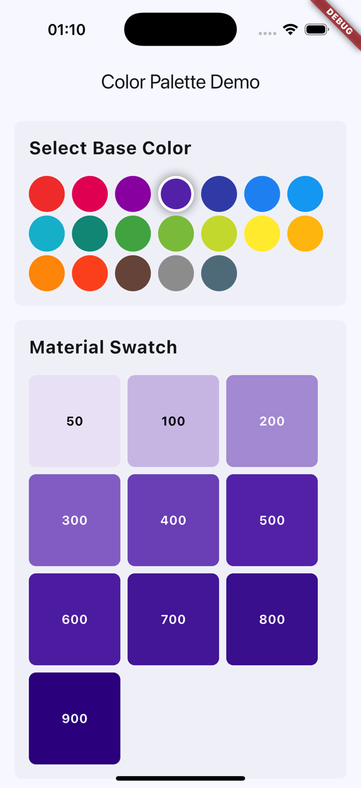
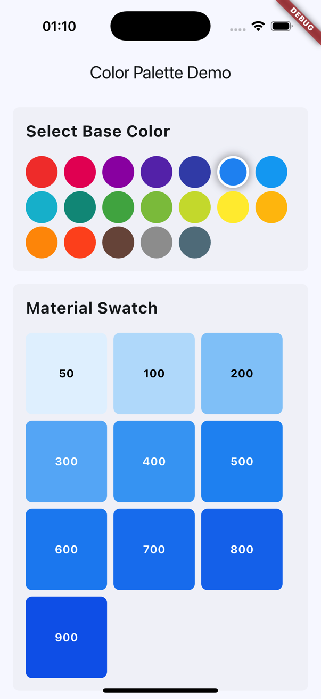
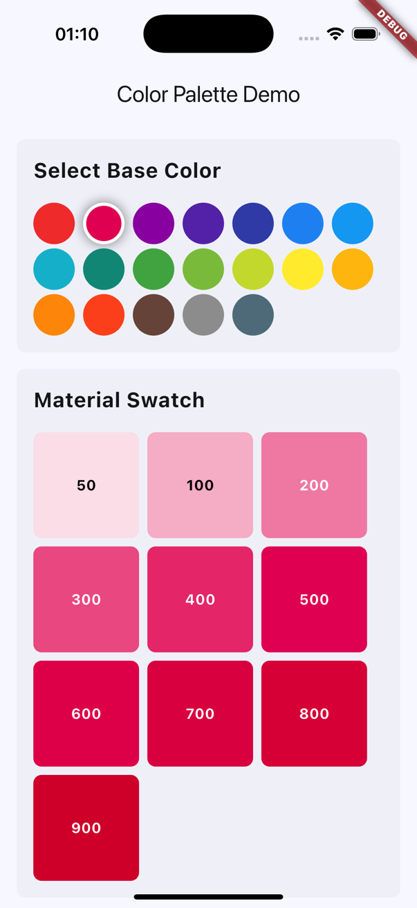

# Flutter Color Palette Generator

A powerful and efficient Flutter library for generating color palettes, shades, and color variations. This library provides utilities for creating material design color swatches and various color harmonies while adhering to Flutter's latest color handling best practices.

## Features

- 🎨 Generate Material Design color swatches
- 🌈 Create monochromatic, analogous, and complementary color palettes
- 📊 Get specific shades or all shades of a color
- ✨ Modern color component handling (using Flutter's new color APIs)
- 💪 Type-safe and null-safe implementation
- 🚀 Efficient color transformations

## Screenshots

|  |  |  |
|-------------------------|------------------------|------------------------|


## Installation

Add this to your package's `pubspec.yaml` file:

```yaml
dependencies:
  color_palette_plus: ^1.0.0
```

## Usage

### Generating Material Color Swatches

```dart
import 'package:color_palette_plus/color_palette_plus.dart';

// Create a material swatch from a base color
final Color baseColor = Color(0xFF2196F3); // Blue
final MaterialColor swatch = ColorPalette.generateSwatch(baseColor);

// Access specific shades
final Color shade500 = swatch[500]!; // Primary color
final Color shade200 = swatch[200]!; // Lighter variation
final Color shade700 = swatch[700]!; // Darker variation
```

### Getting Specific Shades

```dart
// Get a specific shade directly
final Color shade = ColorPalette.getShade(baseColor, 500);

// Get all shades as a map
final Map<int, Color> allShades = ColorPalette.getAllShades(baseColor);
```

### Creating Color Harmonies

#### Monochromatic Palette

```dart
// Generate a monochromatic palette with 5 steps
final List<Color> monochromaticColors = ColorPalettes.monochromatic(
  baseColor,
  steps: 5,
);
```

#### Analogous Palette

```dart
// Generate an analogous color palette
final List<Color> analogousColors = ColorPalettes.analogous(
  baseColor,
  steps: 3,    // Number of colors
  angle: 30,   // Angle between colors
);
```

#### Complementary Colors

```dart
// Get complementary colors
final List<Color> complementaryColors = ColorPalettes.complementary(baseColor);
// Returns [baseColor, complementColor]
```

## Color Shade Values

The library supports the following shade indices for material color swatches:

- 50: Lightest shade
- 100-400: Lighter shades
- 500: Base color
- 600-900: Darker shades

## Advanced Usage

### Custom Shade Map Generation

```dart
// Get a complete map of shades for custom usage
final Map<int, Color> shadeMap = ColorPalette.getAllShades(baseColor);

// Use in a Theme
MaterialApp(
  theme: ThemeData(
    primarySwatch: ColorPalette.generateSwatch(baseColor),
  ),
);
```

### Working with HSL Colors

The library internally handles HSL color transformations for generating harmonious color palettes:

```dart
// Generate a monochromatic palette with custom steps
final List<Color> customMonochromatic = ColorPalettes.monochromatic(
  baseColor,
  steps: 7, // Custom number of color variations
);
```

## Best Practices

1. **Color Selection**
   - Use the 500 shade as your primary color
   - Use lighter shades (50-400) for backgrounds and hover states
   - Use darker shades (600-900) for text and emphasis

2. **Accessibility**
   - Ensure sufficient contrast between text and background colors
   - Test your color combinations with accessibility tools

3. **Performance**
   - Cache generated swatches when used frequently
   - Avoid generating palettes in build methods

## Contributing

Contributions are welcome! Please feel free to submit a Pull Request. For major changes, please open an issue first to discuss what you would like to change.

## License

This project is licensed under the MIT License - see the [LICENSE](LICENSE) file for details

## Notes

The library uses Flutter's modern color APIs and avoids deprecated features:
- Uses `.r`, `.g`, `.b`, `.a` instead of deprecated `.red`, `.green`, `.blue`, `.alpha`
- Proper handling of color components in 0.0-1.0 range
- Efficient color transformations

## Requirements

- Flutter 3.27.0 or higher
- Dart 3.6.0 or higher

## Support

For bugs and feature requests, please create an issue on the GitHub repository.