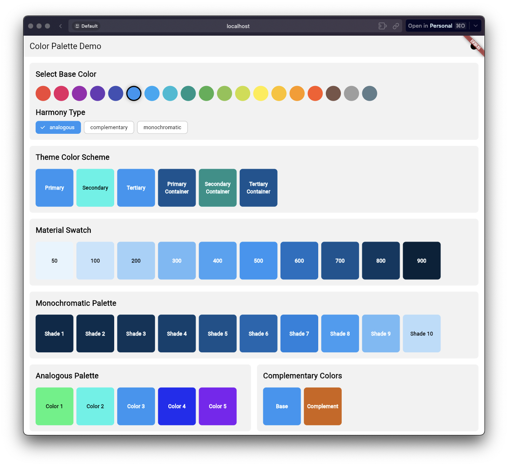

# Flutter Color Palette Generator

A powerful and efficient Flutter library for generating color palettes, shades, and color variations. This library provides utilities for creating material design color swatches and various color harmonies while adhering to Flutter's latest color handling best practices.

[](https://github.com/ishangavidusha/color_palette_plus/actions/workflows/deploy.yml)

## Features

- 🎨 Generate Material Design color swatches
- 🌈 Create monochromatic, analogous, and complementary color palettes
- 📊 Get specific shades or all shades of a color
- 🎯 Automatic theme generation based on a primary color
- 🌗 Support for both light and dark themes
- 🎭 Multiple color harmony options
- 🔧 Customizable theme configurations
- ✨ Modern color component handling (using Flutter's new color APIs)
- 💪 Type-safe and null-safe implementation
- 🚀 Efficient color transformations

## Screenshots



## Demo App (Example)
- [View Demo App](https://ishangavidusha.github.io/color_palette_plus/)

## Installation

Add this to your package's `pubspec.yaml` file:

```yaml
dependencies:
  color_palette_plus: 
```

## Basic Usage

### Generating Material Color Swatches

```dart
import 'package:color_palette_plus/color_palette_plus.dart';

// Create a material swatch from a base color
final Color baseColor = Color(0xFF2196F3); // Blue
final MaterialColor swatch = ColorPalette.generateSwatch(baseColor);

// Access specific shades
final Color shade500 = swatch[500]!; // Primary color
final Color shade200 = swatch[200]!; // Lighter variation
final Color shade700 = swatch[700]!; // Darker variation

// Get a specific shade directly
final Color specificShade = ColorPalette.getShade(baseColor, 500);

// Get all shades as a map
final Map<int, Color> allShades = ColorPalette.getAllShades(baseColor);
```

### Creating Color Harmonies

#### Monochromatic Palette

```dart
// Generate a monochromatic palette with 5 steps
final List<Color> monochromaticColors = ColorPalettes.monochromatic(
  baseColor,
  steps: 5,
);
```

#### Analogous Palette

```dart
// Generate an analogous color palette
final List<Color> analogousColors = ColorPalettes.analogous(
  baseColor,
  steps: 3,    // Number of colors
  angle: 30,   // Angle between colors
);
```

#### Complementary Colors

```dart
// Get complementary colors
final List<Color> complementaryColors = ColorPalettes.complementary(baseColor);
// Returns [baseColor, complementColor]
```

## Theme Generation

### Basic Theme Generation

```dart
// Generate a light theme
final ThemeData lightTheme = ThemeGenerator.generateTheme(
  baseColor,
  config: ThemeConfig(
    brightness: Brightness.light,
  ),
);

// Generate a dark theme
final ThemeData darkTheme = ThemeGenerator.generateTheme(
  baseColor,
  config: ThemeConfig(
    brightness: Brightness.dark,
  ),
);

// Generate both themes at once
final ThemePair themes = ThemeGenerator.generateThemePair(baseColor);
```

### Advanced Theme Configuration

```dart
// Configure color scheme generation
final ThemeData customTheme = ThemeGenerator.generateTheme(
  baseColor,
  config: ThemeConfig(
    brightness: Brightness.light,
    colorSchemeConfig: ColorSchemeConfig(
      harmonyType: HarmonyType.analogous,
      analogousAngle: 30,
      harmonySteps: 5,
    ),
    colorOverrides: {
      ColorRole.primary: customPrimaryColor,
      ColorRole.secondary: customSecondaryColor,
      ColorRole.surface: customSurfaceColor,
    },
  ),
);
```

### Using Generated Themes

```dart
class MyApp extends StatelessWidget {
  final Color primaryColor = Color(0xFF2196F3);

  @override
  Widget build(BuildContext context) {
    final themePair = ThemeGenerator.generateThemePair(
      primaryColor,
      config: ThemeConfig(
        colorSchemeConfig: ColorSchemeConfig(
          harmonyType: HarmonyType.analogous,
        ),
      ),
    );

    return MaterialApp(
      theme: themePair.light,
      darkTheme: themePair.dark,
      themeMode: ThemeMode.system,
      home: MyHomePage(),
    );
  }
}
```

## Color Roles

The library supports all Material 3 color roles for theme customization:

```dart
// Example of using color roles in theme configuration
final ThemeData theme = ThemeGenerator.generateTheme(
  baseColor,
  config: ThemeConfig(
    colorOverrides: {
      ColorRole.primary: primaryColor,
      ColorRole.onPrimary: onPrimaryColor,
      ColorRole.primaryContainer: primaryContainerColor,
      ColorRole.onPrimaryContainer: onPrimaryContainerColor,
      ColorRole.secondary: secondaryColor,
      // ... other color roles
    },
  ),
);
```

## Advanced Usage

### Custom Shade Map Generation

```dart
// Get a complete map of shades for custom usage
final Map<int, Color> shadeMap = ColorPalette.getAllShades(baseColor);

// Access specific shades
final Color shade50 = shadeMap[50]!;   // Lightest
final Color shade900 = shadeMap[900]!; // Darkest
```

### Color Harmony Configuration

```dart
// Configure different harmony types
final ColorSchemeConfig analogousConfig = ColorSchemeConfig(
  harmonyType: HarmonyType.analogous,
  analogousAngle: 45, // Custom angle
  harmonySteps: 4,    // Custom steps
);

final ColorSchemeConfig monochromaticConfig = ColorSchemeConfig(
  harmonyType: HarmonyType.monochromatic,
  harmonySteps: 6,
);

final ColorSchemeConfig complementaryConfig = ColorSchemeConfig(
  harmonyType: HarmonyType.complementary,
);
```

## Best Practices

1. **Theme Generation**
   - Use `ThemeGenerator.generateThemePair()` for consistent light and dark themes
   - Configure color harmonies based on your design needs
   - Override specific color roles only when necessary

2. **Color Selection**
   - Use the 500 shade as your primary color
   - Use lighter shades (50-400) for backgrounds and hover states
   - Use darker shades (600-900) for text and emphasis

3. **Accessibility**
   - Ensure sufficient contrast between text and background colors
   - Test your color combinations with accessibility tools
   - Use the `onColor` variations provided by the color scheme

4. **Performance**
   - Cache generated themes when possible
   - Avoid generating new themes during build
   - Reuse color swatch instances when appropriate

## Contributing

Contributions are welcome! Please feel free to submit a Pull Request. For major changes, please open an issue first to discuss what you would like to change.

## License

This project is licensed under the MIT License - see the [LICENSE](LICENSE) file for details.